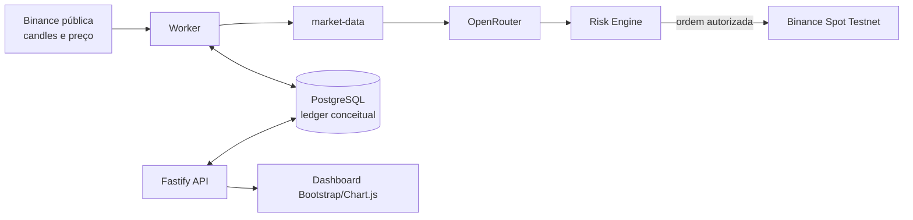

# Arquitetura

## Objetivo

Descrever componentes e responsabilidades reais. Consulte [persistência](11_PERSISTENCIA_E_BANCO.md) e [reconciliação](16_RECONCILIACAO_E_RECUPERACAO.md).

O monorepo pnpm tem `apps/api` (Fastify e dashboard) e `apps/worker` (scheduler e operação). Os packages isolam core/configuração, mercado, IA, risco, exchange e banco. API e worker são processos independentes que compartilham PostgreSQL.

O worker lê configuração do banco, reconcilia antes de negociar e toma advisory lock PostgreSQL por ciclo. A API não tem endpoint arbitrário de compra/venda; `POST /trading/run-once` passa pelo mesmo serviço. `docker compose` inicia `postgres`, `api` e `worker`; apps aplicam migrations antes de subir.
