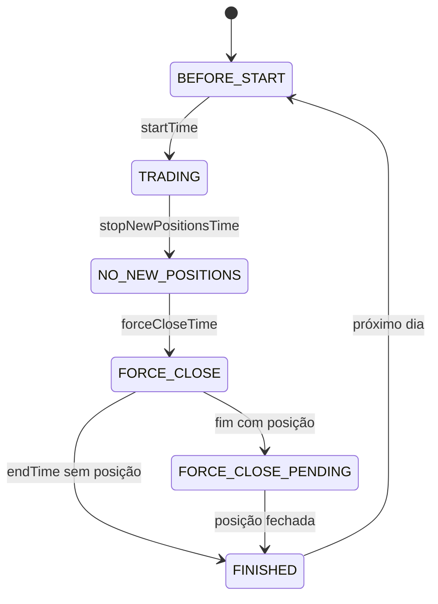

# Trading lifecycle

## Objetivo

Explicar o percurso da sessão e de um ciclo. As regras estão no [motor de risco](08_MOTOR_DE_RISCO.md).

Em `TRADING`, o worker registra check operacional, executa imediatamente ao entrar na fase e depois usa slots ancorados no início. Busca candles 1m/5m/15m, cria snapshot, consulta IA, aplica risco, persiste decisão e, se necessário, cria ordem `PENDING` antes de chamar a Binance. A confirmação atualiza ordem, fills, trade, posição e conta.

Em `NO_NEW_POSITIONS`, BUY vira HOLD e SELL ainda fecha posição. Em `FORCE_CLOSE`, tenta fechar e conta tentativas. Após `endTime`, posição aberta mantém `FORCE_CLOSE_PENDING`, com nova tentativa a cada 30 segundos. `FINISHED` não implica resultado diário: sem posição, gera `daily_results` idempotentemente.

No restart, primeiro ocorre reconciliação; negociação só segue com ledger consistente. Decision cycles não incluem heartbeat, reconciliação, checks de fase ou force-close.
