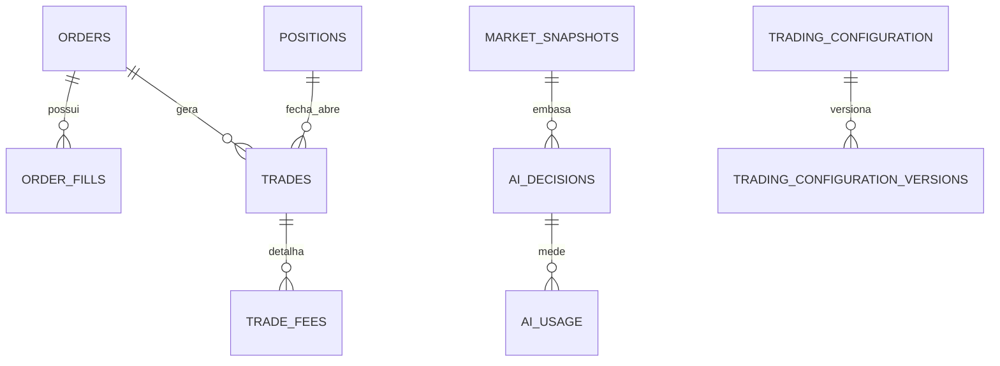

# Persistência e banco

## Objetivo

Mapear o ledger conceitual e suas relações. A recuperação está em [reconciliação](16_RECONCILIACAO_E_RECUPERACAO.md).

PostgreSQL é o ledger da experiência, com timestamps UTC, valores numéricos e JSONB para payloads/fills. O worker usa transações e `client_order_id` único para idempotência. A configuração de uma sessão é copiada para a própria sessão.

| Grupo | Tabelas e finalidade |
| --- | --- |
| Conta e execução | `trading_account`, `positions`, `orders`, `order_fills`, `trades`, `trade_fees` |
| Mercado e IA | `market_snapshots`, `ai_decisions`, `ai_usage` |
| Estado diário | `account_snapshots`, `trading_sessions`, `daily_results` |
| Operação | `system_events`, `worker_heartbeats`, `reconciliation_state` |
| Configuração | `trading_configuration`, `trading_configuration_versions` |

`daily_results` é consolidação final, não substituto do histórico de fills/trades. JSONB guarda dados variáveis como payload de mercado, resposta crua da IA, eventos e taxas por ativo.
