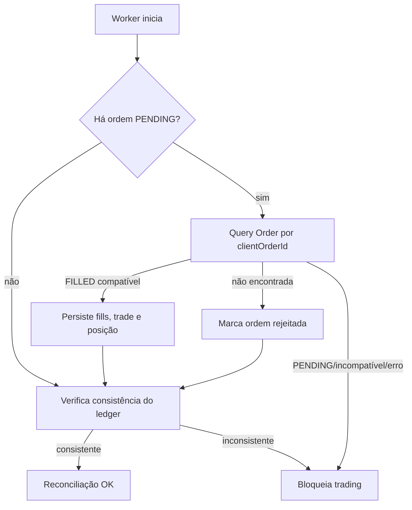

# Reconciliação e recuperação

## Objetivo

Explicar como o sistema conecta ledger e exchange após incerteza. Veja também [Binance](10_BINANCE_TESTNET.md).

Antes de cada operação o worker exige `reconciliation_state=OK`, estado consistente e nenhuma ordem pendente. Uma ordem é criada localmente como `PENDING` antes do envio e recebe client order ID estável. Após crash depois de BUY/SELL, o startup consulta Binance; FILLED compatível é persistido uma única vez, `-2013` marca ausência da ordem como rejeitada, e qualquer estado ainda ambíguo ou Binance indisponível mantém fail-closed.

PostgreSQL é ledger conceitual; Binance é autoridade sobre ordens enviadas. O projeto não usa saldos integrais da conta para “corrigir” o ledger. Repetir execução usa o mesmo client ID quando aplicável, e `recordExecution` é idempotente. Após recuperação, confirme `/health`, `/status`, eventos e posição antes de reativar loop.
